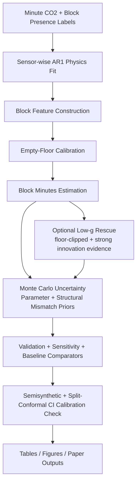
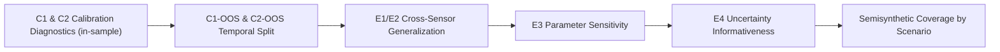
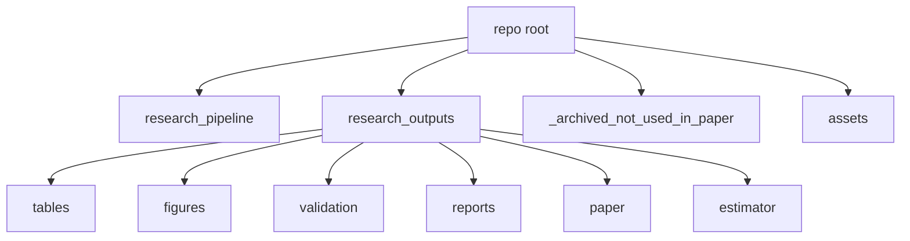
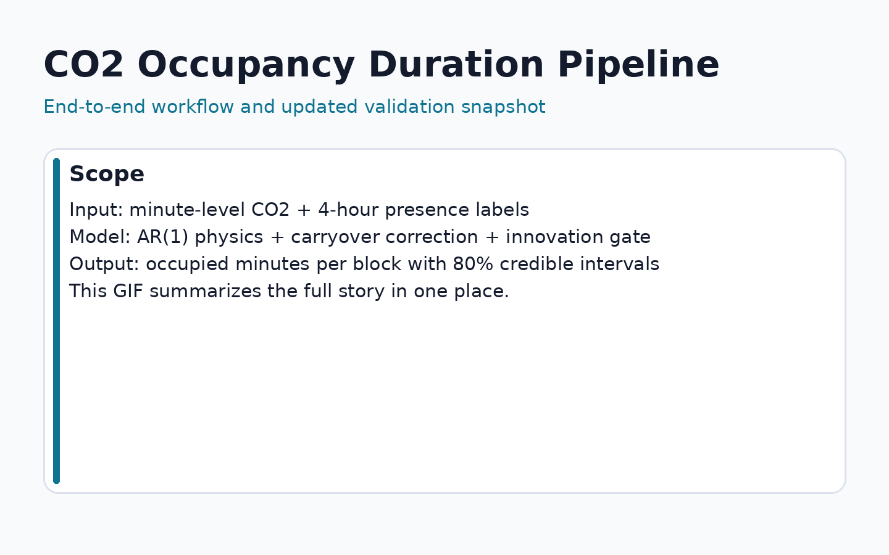

# CO2-Based Occupancy Duration Inference (Spring 2025)

Code + outputs repository for the paper workflow on dormitory CO2-based occupancy duration estimation.

## What This Repo Contains
- `research_pipeline/`: primary paper pipeline code.
- `research_outputs/`: generated outputs (tables, figures, reports, estimator outputs, compiled paper files).
- `_archived_not_used_in_paper/workflow/`: archived exploratory workflows not used in the final paper.
- `_archived_not_used_in_paper/tmp_ensemble_cfg/`: archived config variants.
- `assets/gifs/`: animated previews for key results.

## What Is Excluded
- Raw CO2 source folders.
- Raw occupancy input files.
- Calibration raw data files.

## Pipeline Flow


## Validation Framework


## Repository Layout


## End-to-End GIF (Simple Storyboard)
This GIF explains the full workflow from data to final results in plain steps.



## Key Results Snapshot (Latest Run)
Source: `research_outputs/tables/table04_validation_metrics.csv`

| Metric | Value | Criterion | Pass |
|---|---:|---:|:---:|
| C1 in-sample mean unclamped (label=0) | 14.96 min | < 15 | YES |
| C2 in-sample % under 5 min | 76.2% | > 60% | YES |
| C1-OOS mean unclamped (label=0) | 19.73 min | < 20 | YES |
| C2-OOS % under 5 min | 78.9% | > 50% | YES |
| C1-OOS median unclamped | 0.00 min | descriptive | N/A (descriptive) |
| C1-OOS 5% trimmed mean | 12.81 min | descriptive | N/A (descriptive) |
| C1-OOS tail contribution (top 5%) | 52.6% | descriptive | N/A (descriptive) |
| E1 LOO mean relative MAE | 1.20 | < 1.5 | YES |
| E2 LOO mean Spearman rho | 0.217 | > 0.2 | YES |
| E3 max phi sensitivity change | 51.8% | < 200% | YES |
| E4 high-confidence blocks | 44.3% | > 40% | YES |

`N/A (descriptive)` means the metric is reported for interpretation (robustness/tail behavior), not used as a pass/fail criterion.

## Semisynthetic CI Coverage (Latest Run)
Source: `research_outputs/tables/table10_semisynthetic_coverage.csv`

| Group | Cov80 (Raw MC) | Cov80 (Conformal, eval) | Mean CI Width (Raw) | Mean CI Width (Conformal) | MAE |
|---|---:|---:|---:|---:|---:|
| Continuous | 82.6% | 81.2% | 107.5 min | 107.5 min | 34.2 min |
| Fragmented | 95.8% | 95.8% | 153.1 min | 153.1 min | 49.9 min |
| Stress | 81.7% | 85.7% | 150.6 min | 150.6 min | 42.5 min |
| Overall | 84.5% | 86.0% | 133.5 min | 133.5 min | 40.4 min |

Notes:
- `Cov80 (Raw MC)` are AR(1)-conditional credible intervals.
- `Cov80 (Conformal, eval)` are split-conformal calibrated predictive intervals on held-out semisynthetic cases.
- Stress scenario `g×0.7` is intentionally adversarial (out-of-prior boundary case), so its per-scenario coverage remains the hardest.

## Experimental Low-g Rescue Extension (Not Default)
- Code now includes an optional evidence-gated low-`g` rescue path (`innovation_rescue_*` in `research_pipeline/config.toml`).
- Rescue-enabled run artifacts are saved in `research_outputs/experiments/innovation_rescue_enabled_run/`.
- Rescue improved semisynthetic `stress_g0.7x_120` (`MAE 72.2 -> 61.5`, raw Cov80 `58.3% -> 87.5%`) but substantially hurt empty-room specificity (`C1 14.96 -> 32.61`, `C1-OOS 19.73 -> 54.71`), so default config keeps this extension disabled for submission-grade stability.

## Baseline Comparator Note
Source: `research_outputs/tables/table07_baseline_comparators.csv`

Baseline comparison is computed on a comparable room-level subset (`n_label0=177`, `n_label1=260`) for method-to-method comparability.

## New Robustness Artifacts
- Detectability diagnostics table: `research_outputs/tables/table11_detectability_thresholds.csv`
- Ablation ladder table: `research_outputs/tables/table12_ablation_ladder.csv`
- High-baseline sensor sensitivity table: `research_outputs/tables/table13_high_baseline_sensor_sensitivity.csv`
- Fused-lasso per-sensor hyperparameters: `research_outputs/tables/table14_fused_lasso_hyperparams.csv`
- Innovation-rescue experiment note: `research_outputs/reports/innovation_rescue_experiment.md`
- Detectability figure: `research_outputs/figures/fig15_detectability_thresholds.pdf`
- Ablation figure: `research_outputs/figures/fig16_ablation_ladder.pdf`
- High-baseline sensitivity figure: `research_outputs/figures/fig17_high_baseline_sensitivity.pdf`

## Reproducing
```bash
.venv/bin/python research_pipeline/run_full_pipeline.py
```

Main generated artifacts:
- Validation table: `research_outputs/tables/table04_validation_metrics.csv`
- Baseline comparison: `research_outputs/tables/table07_baseline_comparators.csv`
- Semisynthetic summary: `research_outputs/tables/table09_semisynthetic_summary.csv`
- Detectability summary: `research_outputs/tables/table11_detectability_thresholds.csv`
- Ablation ladder: `research_outputs/tables/table12_ablation_ladder.csv`
- High-baseline sensitivity: `research_outputs/tables/table13_high_baseline_sensor_sensitivity.csv`
- Fused-lasso hyperparameters: `research_outputs/tables/table14_fused_lasso_hyperparams.csv`
- Paper: `research_outputs/paper/main.pdf`
