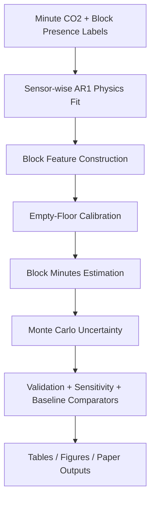
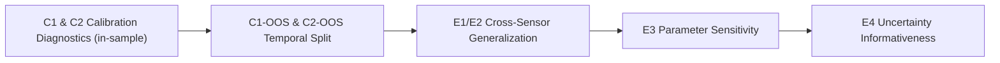
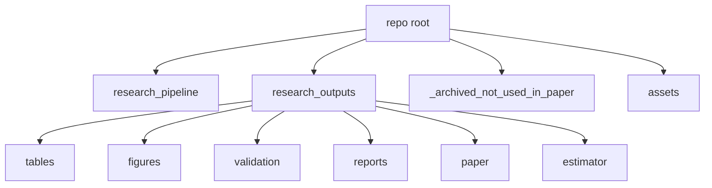

# CO2-Based Occupancy Duration Inference (Spring 2025)

Code + outputs repository for the paper workflow on dormitory CO2-based occupancy duration estimation.

## What This Repo Contains
- `research_pipeline/`: primary paper pipeline code.
- `research_outputs/`: generated outputs (tables, figures, reports, estimator outputs, compiled paper files).
- `_archived_not_used_in_paper/workflow/`: archived exploratory workflows not used in the final paper.
- `_archived_not_used_in_paper/tmp_ensemble_cfg/`: archived config variants.
- `assets/gifs/`: animated previews for key results.

## What Is Excluded
- Raw CO2 source folders.
- Raw occupancy input files.
- Calibration raw data files.

## Pipeline Flow


## Validation Framework


## Repository Layout


## End-to-End GIF (Simple Storyboard)
This GIF explains the full workflow from data to final results in plain steps.


## Additional Result Previews
- Validation + Baselines: `assets/gifs/validation_and_baselines.gif`
- Distribution / Uncertainty / Semisynthetic: `assets/gifs/results_overview.gif`

## Key Results Snapshot (Latest Run)
Source: `research_outputs/tables/table04_validation_metrics.csv`

| Metric | Value | Criterion | Pass |
|---|---:|---:|:---:|
| C1 in-sample mean unclamped (label=0) | 14.85 min | < 15 | YES |
| C2 in-sample % under 5 min | 85.4% | > 60% | YES |
| C1-OOS mean unclamped (label=0) | 46.05 min | < 20 | NO |
| C2-OOS % under 5 min | 61.4% | > 50% | YES |
| E1 LOO mean relative MAE | 1.11 | < 1.5 | YES |
| E2 LOO mean Spearman rho | 0.313 | > 0.2 | YES |
| E3 max phi sensitivity change | 30.7% | < 200% | YES |
| E4 high-confidence blocks | 50.7% | > 40% | YES |

## Baseline Comparator Note
Source: `research_outputs/tables/table07_baseline_comparators.csv`

Baseline comparison is computed on a comparable room-level subset (`n_label0=177`, `n_label1=260`) for method-to-method comparability.

## Reproducing
```bash
python research_pipeline/run_full_pipeline.py
```

Main generated artifacts:
- Validation table: `research_outputs/tables/table04_validation_metrics.csv`
- Baseline comparison: `research_outputs/tables/table07_baseline_comparators.csv`
- Semisynthetic summary: `research_outputs/tables/table09_semisynthetic_summary.csv`
- Paper: `research_outputs/paper/main.pdf`
